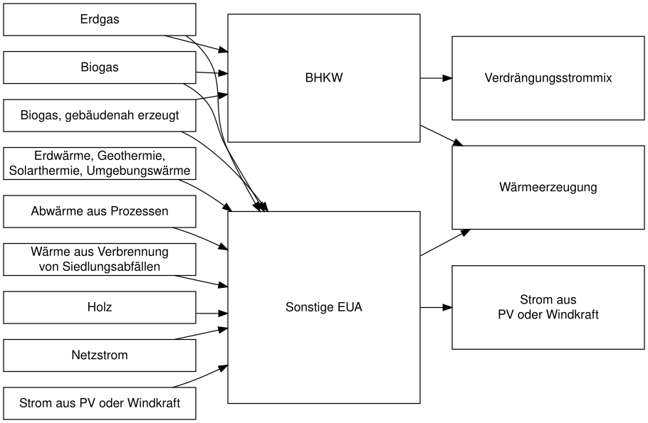

<!-- README.md is generated from README.Rmd. Please edit that file -->

```{r, include = FALSE}
knitr::opts_chunk$set(
  collapse = TRUE,
  comment = "#>"
)
```

# energypro

<!-- badges: start -->
[](https://github.com/BirgerNi/energypro/actions)
[](https://lifecycle.r-lib.org/articles/stages.html#experimental)
<!-- badges: end -->

`energypro` converts output from 
[energypro](https://www.emd-international.com/energypro/) to tidy tibbles.

# Installation

You can install the development version of `energypro` from GitHub.

```{r, eval = FALSE}
# install.packages("devtools")
devtools::install_github("BirgerNi/energypro")
```


# Usage

```{r}
library(energypro)
read_energypro("tests/testthat/pellet_pv.csv")
```


# Data Structure




## Backlog

* [x] Basic tibble w/ data to estimate co2-emission
* [ ] Add clipboard support
* [ ] split up heat generation for primary energy factor
* [ ] split up heat generation for share renewable energy
* [ ] handle chp and pv/wind (hourly data needed)
