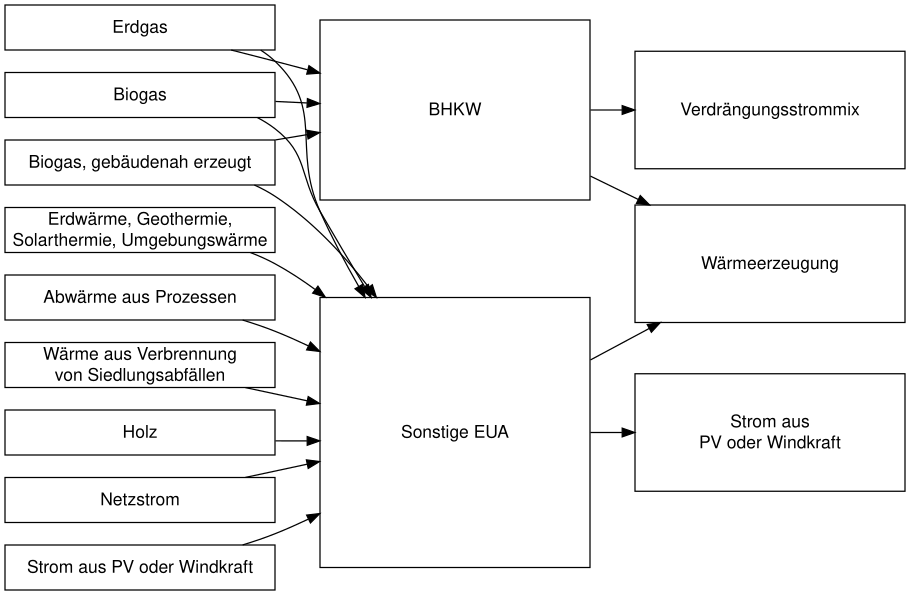

<!-- README.md is generated from README.Rmd. Please edit that file -->

# energypro

<!-- badges: start -->

[](https://github.com/BirgerNi/energypro/actions)
[](https://github.com/BirgerNi/energypro/actions)
[](https://app.codecov.io/gh/BirgerNi/energypro?branch=main%29)
[](https://lifecycle.r-lib.org/articles/stages.html#experimental)
<!-- badges: end -->

`energypro` converts output from
[energypro](https://www.emd-international.com/energypro/) to tidy
tibbles.

# Installation

You can install the development version of `energypro` from GitHub.

``` r
# install.packages("devtools")
devtools::install_github("BirgerNi/energypro")
```

# Usage

``` r
library(energypro)
read_energypro("tests/testthat/pellet_pv.csv")
#> # A tibble: 4 × 4
#>   direction  energy_carrier              ecu          quantity
#>   <chr>      <chr>                       <chr>           <dbl>
#> 1 energy_in  Holz                        Sonstige EUA 3194.   
#> 2 energy_in  Netzstrom                   Sonstige EUA   31.9  
#> 3 energy_out Strom aus PV oder Windkraft Sonstige EUA    0.828
#> 4 energy_out Wärme                       Sonstige EUA 2715.
```

# Data Structure



## Backlog

-   [x] Basic tibble w/ data to estimate co2-emission
-   [ ] Add clipboard support
-   [ ] split up heat generation for primary energy factor
-   [ ] split up heat generation for share renewable energy
-   [ ] handle chp and pv/wind (hourly data needed)
